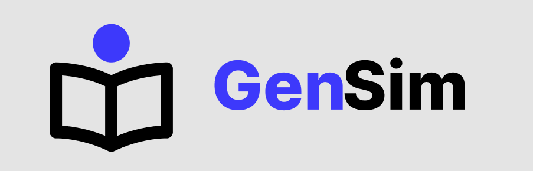
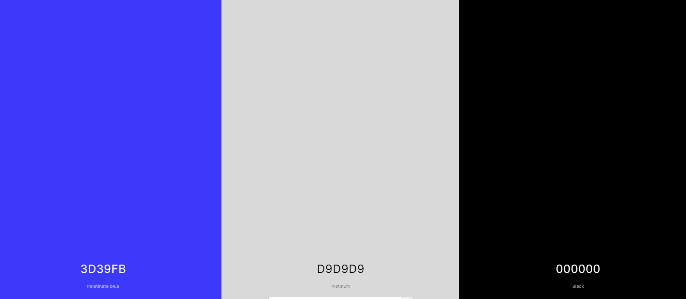

  <h1 align="center">
    ProjetoGenSim
     
     
    
  </h1>
  
O GenSim é o projeto desenvolvido por mim, Miguel Prata, com intuíto de completar o curso FrontEnd da Kick 2024, o GenSim é um gerador de simulado para ajudar os estudantes a estudar para os vestibulares como o ENEM.

  <h3 align="center">
    Paleta de Cores
   
   
  
  </h3>
   
  
A coloração focada no azul se dá por conta da transmissão de seu significado, o azul transmite segurança, confiança e tranquilidade, tais sentimentos ou emoções são algo muito necessário para ter um bom desempenho nos vestibulares, por tal motivo utilizei dessas cores.

